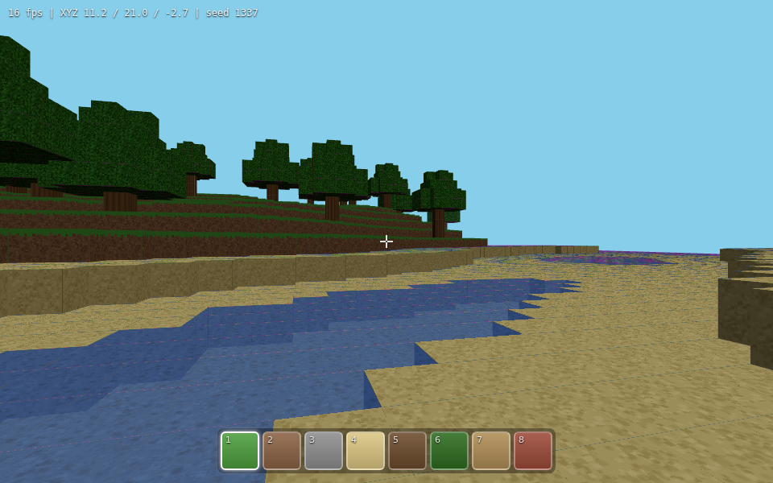

# BlockCraft

Three.js で作る、ブラウザ上で動作するマインクラフト風ボクセルゲーム。

**▶ Play:** https://nitou-kanazawa.github.io/demo-web-BlockCraft/



## 操作方法

| 操作 | キー / マウス |
|------|---------------|
| 開始 | 画面クリック（ポインタロック） |
| 移動 | WASD / 矢印キー |
| ジャンプ | Space |
| 視点 | マウス |
| ブロック破壊 | 左クリック長押し（硬度とツールで時間が変化） |
| ブロック設置 / 使用 | 右クリック（作業台は右クリックで開く） |
| ブロック選択 | 1–9 キー / マウスホイール |
| インベントリ | E |
| 解除 | Esc |

URL に `?seed=123` を付けると別のワールドが生成されます。

## 特徴

- **ビルド不要の静的サイト** — GitHub Pages（main ブランチ）から直接配信。Three.js は `vendor/` に同梱し importmap で解決
- **手続き地形生成** — シード付き値ノイズ（fBm）によるハイトマップ、砂浜・水面・チャンク境界を跨いでも整合する樹木
- **チャンクベース描画** — 16×64×16 チャンク、隠面カリングメッシング、面方向の陰影を頂点色にベイク、プレイヤー追従のチャンクストリーミング
- **物理** — AABB 軸分離衝突、サブステップによるトンネリング防止、重力・ジャンプ・壁ずり
- **ブロック操作** — ボクセル DDA レイキャスト、注視ハイライト、硬度に応じた採掘時間と進捗表示
- **サバイバル要素** — インベントリ（36スロット）、ドロップ収集、ツール（木/石のピッケル・斧・シャベル）、作業台での シェイプドクラフト
- **動物モブ** — ブタとヒツジが草地にスポーンし徘徊（段差はジャンプで越える）
- **テクスチャもプロシージャル** — Canvas 2D で描くテクスチャアトラスとピクセルアートのアイテムアイコン（画像アセットなし）

## 開発

```bash
npm install        # devDependencies (vitest) のインストール
npm test           # ユニットテスト実行
npx http-server .  # ローカル配信（任意の静的サーバでよい）
```

## アーキテクチャ

ゲームロジックは DOM / Three.js 非依存の純粋モジュール（`src/core/`）に分離し、Node 上の Vitest でテストしています。

```
src/
├── core/          # 純ロジック（すべてユニットテスト対象）
│   ├── math.js      # clamp / floored mod / lerp / smootherstep
│   ├── noise.js     # シード付き 2D 値ノイズ + fBm（mulberry32）
│   ├── blocks.js    # ブロック定義（solid / transparent 属性）
│   ├── chunk.js     # 16×64×16 ボクセル格納（Uint8Array）
│   ├── worldgen.js  # 地形・砂浜・水面・樹木の生成
│   ├── world.js     # チャンク管理・ワールド座標アクセス・dirty 伝播
│   ├── mesher.js    # 隠面カリングメッシング・UV・面陰影
│   ├── physics.js   # AABB 衝突・重力・ジャンプ（プレイヤー/モブ共用）
│   ├── raycast.js   # ボクセル DDA（注視ブロック特定）
│   ├── items.js     # アイテム定義・ドロップ表
│   ├── inventory.js # スロット管理・スタック・クリック移動
│   ├── breaking.js  # 硬度・採掘時間・進捗トラッカー
│   ├── crafting.js  # シェイプドレシピ照合
│   └── mobs.js      # 動物の徘徊AI・スポーン管理
├── render/        # Three.js 依存
│   ├── atlas.js         # プロシージャルテクスチャアトラス
│   ├── worldRenderer.js # チャンクメッシュの構築 / 破棄管理
│   └── mobRenderer.js   # 動物のボックスモデルと歩行アニメ
├── player/
│   ├── controls.js    # ポインタロック・キー入力 → 移動方向
│   └── interaction.js # 採掘 / 設置 / ブロック使用・ハイライト
├── ui/
│   ├── inventoryUI.js # ホットバー・インベントリ・クラフト UI
│   └── itemIcons.js   # ピクセルアートのアイテムアイコン
└── main.js        # 配線とゲームループ
```

## 開発タスク（各タスク = 1 PR）

| # | タスク | PR | 状態 |
|---|--------|----|------|
| 1 | プロジェクト基盤（Three.js vendor / Vitest / 最小シーン） | #1 | ✅ |
| 2 | ボクセルワールドコア（ブロック・チャンク・地形生成） | #2 | ✅ |
| 3 | メッシング＆描画（面カリング・テクスチャアトラス） | #3 | ✅ |
| 4 | プレイヤー＆物理（ポインタロック・WASD・AABB衝突） | #4 | ✅ |
| 5 | ブロック操作（DDAレイキャスト・設置/破壊・ホットバー） | #5 | ✅ |
| 6 | 仕上げ（面陰影・HUD・ドキュメント） | #6 | ✅ |
| 7 | インベントリ（アイテム・ドロップ収集・設置消費） | #7 | ✅ |
| 8 | ブロック破壊時間（硬度・長押し採掘・進捗表示） | #8 | ✅ |
| 9 | ツール（ピッケル/斧/シャベル・採掘速度倍率） | #9 | ✅ |
| 10 | クラフト（2x2手持ち＋作業台3x3・レシピ） | #10 | ✅ |
| 11 | 動物モブ（ブタ/ヒツジ・徘徊AI・スポーン管理） | #11 | ✅ |

各 PR にはユニットテスト（Vitest, 計116件）とヘッドレス Chromium での動作確認を含みます。

### クラフトレシピ

| 材料 | 結果 |
|------|------|
| 原木 ×1 | 板材 ×4 |
| 板材 ×2（縦） | 棒 ×4 |
| 板材 2×2 | 作業台 |
| 石 2×2 | レンガ ×4 |
| 板材/石 ×3 ＋ 棒 ×2（T字） | ピッケル |
| 板材/石 ×3 ＋ 棒 ×2（L字） | 斧 |
| 板材/石 ×1 ＋ 棒 ×2（縦） | シャベル |

ツール類は作業台（3×3）でのみ作成できます。
